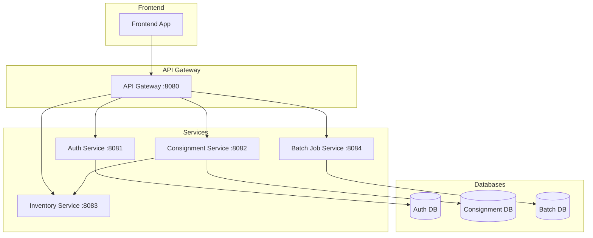

# API Endpoint Documentation - Consignment Backend

Dokumen ini berisi daftar lengkap semua endpoint API yang tersedia di project Consignment Backend untuk keperluan integrasi frontend.

## Daftar Isi

1. [Auth Service](#1-auth-service)
2. [Consignment Service](#2-consignment-service)
3. [Inventory Service](#3-inventory-service)
4. [Batch Job Service](#4-batch-job-service)

---

## 1. Auth Service

**Base URL**: `/auth`

### 1.1 Login

- **Endpoint**: `POST /auth/login`
- **Description**: Autentikasi user dan mendapatkan JWT token

**Request Body**:
```json
{
  "username": "string (required)",
  "password": "string (required)"
}
```

**Response (Success - 200)**:
```json
{
  "token": "string (JWT token)",
  "token_type": "Bearer",
  "expires_in": 86400,
  "username": "string",
  "roles": ["ROLE_USER"]
}
```

**Response (Error - 401)**:
```json
{
  "error": "Invalid username or password"
}
```

---

### 1.2 Register

- **Endpoint**: `POST /auth/register`
- **Description**: Registrasi user baru

**Request Body**:
```json
{
  "username": "string (required)",
  "email": "string (required)",
  "password": "string (required)"
}
```

**Response (Success - 200)**:
```json
{
  "message": "User registered successfully"
}
```

**Response (Error - 400)**:
```json
{
  "error": "Username already taken"
}
```

---

### 1.3 Validate Token

- **Endpoint**: `POST /auth/validate`
- **Description**: Validasi JWT token

**Headers**:
| Name | Type | Required |
|------|------|----------|
| Authorization | string | Yes (Bearer token) |

**Response (Valid - 200)**:
```json
{
  "valid": true,
  "username": "string"
}
```

**Response (Invalid - 401)**:
```json
{
  "valid": false
}
```

---

## 2. Consignment Service

**Base URL**: `/api` (via API Gateway)

### 2.1 Consignment Controller

**Base Path**: `/api/v1/consignments`

#### 2.1.1 Request Consignment

- **Endpoint**: `POST /api/v1/consignments/request`
- **Description**: Membuat permintaan consignment baru

**Request Body**:
```json
{
  "sku": "string (required)",
  "quantity": "integer (required, min: 1)",
  "requestStore": "string (required)",
  "supplier": "string (required)"
}
```

**Response**:
```json
{
  "requestId": "string",
  "sku": "string",
  "quantity": "integer",
  "requestStore": "string",
  "supplier": "string",
  "status": "string",
  "message": "string",
  "createdAt": "2024-01-01T00:00:00Z",
  "updatedAt": "2024-01-01T00:00:00Z"
}
```

---

#### 2.1.2 List All Consignments

- **Endpoint**: `GET /api/v1/consignments`
- **Description**: Mendapatkan daftar semua consignment

**Response**:
```json
[
  {
    "requestId": "string",
    "sku": "string",
    "quantity": "integer",
    "requestStore": "string",
    "supplier": "string",
    "status": "string",
    "message": "string",
    "createdAt": "2024-01-01T00:00:00Z",
    "updatedAt": "2024-01-01T00:00:00Z"
  }
]
```

---

#### 2.1.3 Get Consignment by ID

- **Endpoint**: `GET /api/v1/consignments/{requestId}`
- **Description**: Mendapatkan detail consignment berdasarkan ID

**Path Parameters**:
| Name | Type | Required |
|------|------|----------|
| requestId | string | Yes |

**Response**: Same as 2.1.1 single object

---

#### 2.1.4 Update Consignment Status

- **Endpoint**: `PATCH /api/v1/consignments/{requestId}/status`
- **Description**: Update status consignment

**Path Parameters**:
| Name | Type | Required |
|------|------|----------|
| requestId | string | Yes |

**Request Body**:
```json
{
  "status": "string (required)",
  "message": "string (optional)"
}
```

**Response**: Same as 2.1.1

---

### 2.2 Consignment Setup Controller

**Base Path**: `/api/consignment-setup`

#### 2.2.1 List Setup Items

- **Endpoint**: `GET /api/consignment-setup/items`
- **Description**: Mendapatkan daftar semua item setup consignment

**Response**:
```json
[
  {
    "itemCode": "string",
    "itemName": "string",
    "supplierCount": "integer"
  }
]
```

---

#### 2.2.2 Get Item by Code

- **Endpoint**: `GET /api/consignment-setup/item/{itemCode}`
- **Description**: Mendapatkan detail item berdasarkan kode

**Path Parameters**:
| Name | Type | Required |
|------|------|----------|
| itemCode | string | Yes |

**Response**: Same as 2.2.1 single object with more details

---

#### 2.2.3 Create External Supplier Setup

- **Endpoint**: `POST /api/consignment-setup/item/{itemCode}/external-supplier`
- **Description**: Menambahkan setup supplier eksternal untuk item

**Path Parameters**:
| Name | Type | Required |
|------|------|----------|
| itemCode | string | Yes |

**Request Body**:
```json
{
  "supplierCode": "string (required)",
  "supplierType": "string (required)",
  "contractNumber": "string (required)",
  "consigneeCompany": "string (required)",
  "consigneeStore": "string (required)",
  "currentInventoryQty": "integer (required, min: 0)"
}
```

**Response**:
```json
{
  "id": "string",
  "itemCode": "string",
  "supplierCode": "string",
  "supplierType": "string",
  "contractNumber": "string",
  "consigneeCompany": "string",
  "consigneeStore": "string",
  "currentInventoryQty": "integer"
}
```

---

#### 2.2.4 Update External Supplier Setup

- **Endpoint**: `PUT /api/consignment-setup/item/{itemCode}/external-supplier/{id}`
- **Description**: Update setup supplier eksternal

**Path Parameters**:
| Name | Type | Required |
|------|------|----------|
| itemCode | string | Yes |
| id | string | Yes |

**Request Body**: Same as 2.2.3

**Response**: Same as 2.2.3

---

#### 2.2.5 Delete External Supplier Setup

- **Endpoint**: `DELETE /api/consignment-setup/item/{itemCode}/external-supplier/{id}`
- **Description**: Hapus setup supplier eksternal

**Path Parameters**:
| Name | Type | Required |
|------|------|----------|
| itemCode | string | Yes |
| id | string | Yes |

**Response**: `204 No Content`

---

#### 2.2.6 Create Internal Supplier Setup

- **Endpoint**: `POST /api/consignment-setup/item/{itemCode}/internal-supplier`
- **Description**: Menambahkan setup supplier internal untuk item

**Path Parameters**:
| Name | Type | Required |
|------|------|----------|
| itemCode | string | Yes |

**Request Body**:
```json
{
  "supplierCode": "string (required)",
  "supplierStore": "string (required)",
  "consigneeCompany": "string (required)",
  "consigneeStore": "string (required)"
}
```

**Response**:
```json
{
  "id": "string",
  "itemCode": "string",
  "supplierCode": "string",
  "supplierStore": "string",
  "consigneeCompany": "string",
  "consigneeStore": "string"
}
```

---

### 2.3 CSA Controller - Consignment Stock Adjustment

**Base Path**: `/api/csa`

#### 2.3.1 Search CSA

- **Endpoint**: `GET /api/csa`
- **Description**: Pencarian dokumen CSA

**Query Parameters**:
| Name | Type | Required |
|------|------|----------|
| company | string | No |
| store | string | No |
| transactionType | string | No |
| status | string | No |
| createdBy | string | No |
| referenceNo | string | No |

**Response**:
```json
[
  {
    "id": "string",
    "docNo": "string",
    "company": "string",
    "store": "string",
    "supplierCode": "string",
    "supplierContract": "string",
    "transactionType": "string",
    "referenceNo": "string",
    "reasonCode": "string",
    "remark": "string",
    "createFrom": "string",
    "status": "string",
    "createdBy": "string",
    "releasedAt": "2024-01-01T00:00:00Z",
    "releasedBy": "string",
    "createdAt": "2024-01-01T00:00:00Z",
    "updatedAt": "2024-01-01T00:00:00Z",
    "items": [
      {
        "id": "string",
        "itemCode": "string",
        "itemName": "string",
        "qty": 10.5,
        "uom": "string",
        "settlementDecision": "string"
      }
    ]
  }
]
```

---

#### 2.3.2 Get CSA by ID

- **Endpoint**: `GET /api/csa/{id}`
- **Description**: Mendapatkan detail CSA berdasarkan ID

**Path Parameters**:
| Name | Type | Required |
|------|------|----------|
| id | string | Yes |

**Response**: Same as 2.3.1 single object

---

#### 2.3.3 Create CSA

- **Endpoint**: `POST /api/csa`
- **Description**: Membuat dokumen CSA baru

**Request Body**:
```json
{
  "company": "string (required)",
  "store": "string (required)",
  "supplierCode": "string (optional)",
  "supplierContract": "string (optional)",
  "transactionType": "string (required)",
  "referenceNo": "string (optional)",
  "reasonCode": "string (optional)",
  "remark": "string (optional)",
  "createFrom": "string (optional)",
  "createdBy": "string (required)",
  "items": [
    {
      "itemCode": "string (required)",
      "itemName": "string (optional)",
      "qty": 10.5,
      "uom": "string (required)",
      "settlementDecision": "string (required)"
    }
  ]
}
```

**Response**: Same as 2.3.1 single object

---

#### 2.3.4 Release CSA

- **Endpoint**: `PUT /api/csa/{id}/release`
- **Description**: Release dokumen CSA

**Path Parameters**:
| Name | Type | Required |
|------|------|----------|
| id | string | Yes |

**Headers**:
| Name | Type | Required |
|------|------|----------|
| X-User | string | No |

**Response**: Same as 2.3.1 single object

---

### 2.4 CSO Controller - Consignment Stock Out

**Base Path**: `/api/cso`

#### 2.4.1 Search CSO

- **Endpoint**: `GET /api/cso`
- **Description**: Pencarian dokumen CSO

**Query Parameters**:
| Name | Type | Required |
|------|------|----------|
| company | string | No |
| store | string | No |
| customerCode | string | No |
| supplierCode | string | No |
| supplierContract | string | No |
| createdMethod | string | No |
| referenceNo | string | No |
| itemCode | string | No |
| status | string | No |

**Response**:
```json
[
  {
    "id": "string",
    "docNo": "string",
    "company": "string",
    "store": "string",
    "customerCode": "string",
    "customerBranch": "string",
    "customerEmail": "string",
    "supplierCode": "string",
    "supplierContract": "string",
    "autoGenerateCsdo": "boolean",
    "note": "string",
    "status": "string",
    "createdBy": "string",
    "createdMethod": "string",
    "referenceNo": "string",
    "releasedAt": "2024-01-01T00:00:00Z",
    "releasedBy": "string",
    "createdAt": "2024-01-01T00:00:00Z",
    "updatedAt": "2024-01-01T00:00:00Z",
    "items": [
      {
        "id": "string",
        "itemCode": "string",
        "qty": 10.5,
        "uom": "string"
      }
    ]
  }
]
```

---

#### 2.4.2 Get CSO by ID

- **Endpoint**: `GET /api/cso/{id}`
- **Description**: Mendapatkan detail CSO berdasarkan ID

**Response**: Same as 2.4.1 single object

---

#### 2.4.3 Create CSO

- **Endpoint**: `POST /api/cso`
- **Description**: Membuat dokumen CSO baru

**Request Body**:
```json
{
  "company": "string (required)",
  "store": "string (required)",
  "customerCode": "string (required)",
  "customerBranch": "string (optional)",
  "customerEmail": "string (optional)",
  "supplierCode": "string (required)",
  "supplierContract": "string (required)",
  "autoGenerateCsdo": "boolean",
  "note": "string (optional)",
  "createdBy": "string (required)",
  "createdMethod": "string (required)",
  "referenceNo": "string (optional)",
  "items": [
    {
      "itemCode": "string (required)",
      "qty": 10.5,
      "uom": "string (required)"
    }
  ]
}
```

**Response**: Same as 2.4.1 single object

---

#### 2.4.4 Release CSO

- **Endpoint**: `PUT /api/cso/{id}/release`
- **Description**: Release dokumen CSO

**Headers**:
| Name | Type | Required |
|------|------|----------|
| X-User | string | No |

**Response**: Same as 2.4.1 single object

---

#### 2.4.5 Delete CSO

- **Endpoint**: `DELETE /api/cso/{id}`
- **Description**: Hapus dokumen CSO

**Response**: `204 No Content`

---

#### 2.4.6 Auto Create CSO

- **Endpoint**: `POST /api/acmm/cso/auto-create`
- **Description**: Auto create dokumen CSO

**Request Body**: Same as 2.4.3

**Response**: Same as 2.4.1 single object

---

### 2.5 CSR Controller - Consignment Stock Return

**Base Path**: `/api/csr`

#### 2.5.1 Search CSR

- **Endpoint**: `GET /api/csr`
- **Description**: Pencarian dokumen CSR

**Query Parameters**:
| Name | Type | Required |
|------|------|----------|
| company | string | No |
| store | string | No |
| supplierCode | string | No |
| supplierContract | string | No |
| status | string | No |
| createdBy | string | No |
| referenceNo | string | No |
| itemCode | string | No |

**Response**:
```json
[
  {
    "id": "string",
    "docNo": "string",
    "company": "string",
    "store": "string",
    "supplierCode": "string",
    "supplierContract": "string",
    "internalSupplierStore": "string",
    "supplierConfirmNote": "string",
    "reasonCode": "string",
    "remark": "string",
    "status": "string",
    "createdBy": "string",
    "referenceNo": "string",
    "releasedAt": "2024-01-01T00:00:00Z",
    "completedAt": "2024-01-01T00:00:00Z",
    "createdAt": "2024-01-01T00:00:00Z",
    "updatedAt": "2024-01-01T00:00:00Z",
    "items": [
      {
        "id": "string",
        "itemCode": "string",
        "uom": "string",
        "qty": 10.5,
        "actualQty": 10.0
      }
    ]
  }
]
```

---

#### 2.5.2 Get CSR by ID

- **Endpoint**: `GET /api/csr/{id}`
- **Description**: Mendapatkan detail CSR

**Response**: Same as 2.5.1 single object

---

#### 2.5.3 Create CSR

- **Endpoint**: `POST /api/csr`
- **Description**: Membuat dokumen CSR baru

**Request Body**:
```json
{
  "company": "string (required)",
  "store": "string (required)",
  "supplierCode": "string (required)",
  "supplierContract": "string (required)",
  "internalSupplierStore": "string (optional)",
  "supplierConfirmNote": "string (optional)",
  "reasonCode": "string (optional)",
  "remark": "string (optional)",
  "createdBy": "string (required)",
  "referenceNo": "string (optional)",
  "items": [
    {
      "itemCode": "string (required)",
      "uom": "string (required)",
      "qty": 10.5,
      "actualQty": 10.0
    }
  ]
}
```

**Response**: Same as 2.5.1 single object

---

#### 2.5.4 Release CSR

- **Endpoint**: `PUT /api/csr/{id}/release`
- **Description**: Release dokumen CSR

**Response**: Same as 2.5.1 single object

---

#### 2.5.5 Update Actual Quantity

- **Endpoint**: `PUT /api/csr/{id}/detail/{detailId}/actual-qty`
- **Description**: Update actual quantity item CSR

**Path Parameters**:
| Name | Type | Required |
|------|------|----------|
| id | string | Yes |
| detailId | string | Yes |

**Request Body**:
```json
{
  "actualQty": 10.0
}
```

**Response**: Same as 2.5.1 single object

---

#### 2.5.6 Complete CSR

- **Endpoint**: `PUT /api/csr/{id}/complete`
- **Description**: Menyelesaikan dokumen CSR

**Response**: Same as 2.5.1 single object

---

### 2.6 CSRQ Controller - Consignment Stock Requisition

**Base Path**: `/api/csrq`

#### 2.6.1 Search CSRQ

- **Endpoint**: `GET /api/csrq`
- **Description**: Pencarian dokumen CSRQ

**Query Parameters**:
| Name | Type | Required |
|------|------|----------|
| company | string | No |
| store | string | No |
| supplierCode | string | No |
| supplierContract | string | No |
| branch | string | No |
| internalSupplierStore | string | No |
| createdMethod | string | No |
| referenceNo | string | No |
| itemCode | string | No |
| status | string | No |

**Response**:
```json
[
  {
    "id": "string",
    "docNo": "string",
    "company": "string",
    "store": "string",
    "supplierCode": "string",
    "supplierContract": "string",
    "branch": "string",
    "internalSupplierStore": "string",
    "notes": "string",
    "status": "string",
    "createdBy": "string",
    "createdMethod": "string",
    "referenceNo": "string",
    "releasedAt": "2024-01-01T00:00:00Z",
    "createdAt": "2024-01-01T00:00:00Z",
    "updatedAt": "2024-01-01T00:00:00Z",
    "items": [
      {
        "id": "string",
        "itemCode": "string",
        "qty": 10.5,
        "uom": "string"
      }
    ]
  }
]
```

---

#### 2.6.2 Get CSRQ by ID

- **Endpoint**: `GET /api/csrq/{id}`
- **Description**: Mendapatkan detail CSRQ

**Response**: Same as 2.6.1 single object

---

#### 2.6.3 Create CSRQ

- **Endpoint**: `POST /api/csrq`
- **Description**: Membuat dokumen CSRQ baru

**Request Body**:
```json
{
  "company": "string (required)",
  "store": "string (required)",
  "supplierCode": "string (required)",
  "supplierContract": "string (required)",
  "branch": "string (optional)",
  "internalSupplierStore": "string (optional)",
  "notes": "string (optional)",
  "createdBy": "string (required)",
  "createdMethod": "string (required)",
  "referenceNo": "string (optional)",
  "items": [
    {
      "itemCode": "string (required)",
      "qty": 10.5,
      "uom": "string (required)"
    }
  ]
}
```

**Response**: Same as 2.6.1 single object

---

#### 2.6.4 Release CSRQ

- **Endpoint**: `PUT /api/csrq/{id}/release`
- **Description**: Release dokumen CSRQ

**Response**: Same as 2.6.1 single object

---

#### 2.6.5 Delete CSRQ

- **Endpoint**: `DELETE /api/csrq/{id}`
- **Description**: Hapus dokumen CSRQ

**Response**: `204 No Content`

---

### 2.7 CSRV Controller - Consignment Stock Receive

**Base Path**: `/api/csrv`

#### 2.7.1 Search CSRV

- **Endpoint**: `GET /api/csrv`
- **Description**: Pencarian dokumen CSRV

**Query Parameters**:
| Name | Type | Required |
|------|------|----------|
| company | string | No |
| receivingStore | string | No |
| supplierCode | string | No |
| supplierContract | string | No |
| branch | string | No |
| createdMethod | string | No |
| referenceNo | string | No |
| itemCode | string | No |
| status | string | No |

**Response**:
```json
[
  {
    "id": "string",
    "docNo": "string",
    "company": "string",
    "receivingStore": "string",
    "supplierCode": "string",
    "supplierContract": "string",
    "branch": "string",
    "supplierDoNo": "string",
    "deliveryDate": "2024-01-01",
    "remark": "string",
    "status": "string",
    "createdBy": "string",
    "createdMethod": "string",
    "referenceNo": "string",
    "releasedAt": "2024-01-01T00:00:00Z",
    "createdAt": "2024-01-01T00:00:00Z",
    "updatedAt": "2024-01-01T00:00:00Z",
    "items": [
      {
        "id": "string",
        "itemCode": "string",
        "qty": 10.5,
        "uom": "string"
      }
    ]
  }
]
```

---

#### 2.7.2 Get CSRV by ID

- **Endpoint**: `GET /api/csrv/{id}`
- **Description**: Mendapatkan detail CSRV

**Response**: Same as 2.7.1 single object

---

#### 2.7.3 Create CSRV

- **Endpoint**: `POST /api/csrv`
- **Description**: Membuat dokumen CSRV baru

**Request Body**:
```json
{
  "company": "string (required)",
  "receivingStore": "string (required)",
  "supplierCode": "string (required)",
  "supplierContract": "string (required)",
  "branch": "string (optional)",
  "supplierDoNo": "string (optional)",
  "deliveryDate": "2024-01-01",
  "remark": "string (optional)",
  "createdBy": "string (required)",
  "createdMethod": "string (required)",
  "referenceNo": "string (optional)",
  "items": [
    {
      "itemCode": "string (required)",
      "qty": 10.5,
      "uom": "string (required)"
    }
  ]
}
```

**Response**: Same as 2.7.1 single object

---

#### 2.7.4 Release CSRV

- **Endpoint**: `PUT /api/csrv/{id}/release`
- **Description**: Release dokumen CSRV

**Response**: Same as 2.7.1 single object

---

#### 2.7.5 Auto Create CSRV

- **Endpoint**: `POST /api/acmm/csrv/auto-create`
- **Description**: Auto create dokumen CSRV

**Request Body**: Same as 2.7.3

**Response**: Same as 2.7.1 single object

---

### 2.8 CSDO Controller - Consignment Stock Delivery Order

**Base Path**: `/api/csdo`

#### 2.8.1 Search CSDO

- **Endpoint**: `GET /api/csdo`
- **Description**: Pencarian dokumen CSDO

**Query Parameters**:
| Name | Type | Required |
|------|------|----------|
| company | string | No |
| store | string | No |
| customerCode | string | No |
| status | string | No |
| createdMethod | string | No |
| referenceNo | string | No |
| itemCode | string | No |

**Response**:
```json
[
  {
    "id": "string",
    "docNo": "string",
    "company": "string",
    "store": "string",
    "customerCode": "string",
    "status": "string",
    "createdMethod": "string",
    "referenceNo": "string",
    "releasedAt": "2024-01-01T00:00:00Z",
    "createdAt": "2024-01-01T00:00:00Z",
    "updatedAt": "2024-01-01T00:00:00Z",
    "items": [
      {
        "id": "string",
        "itemCode": "string",
        "qty": 10.5,
        "uom": "string"
      }
    ]
  }
]
```

---

#### 2.8.2 Get CSDO by ID

- **Endpoint**: `GET /api/csdo/{id}`
- **Description**: Mendapatkan detail CSDO

**Response**: Same as 2.8.1 single object

---

#### 2.8.3 Transfer from CSO

- **Endpoint**: `POST /api/csdo/transfer/{csoId}`
- **Description**: Transfer dokumen dari CSO ke CSDO

**Path Parameters**:
| Name | Type | Required |
|------|------|----------|
| csoId | string | Yes |

**Request Body**:
```json
{
  "transferredBy": "string (required)",
  "notes": "string (optional)"
}
```

**Response**: Same as 2.8.1 single object

---

#### 2.8.4 Release CSDO

- **Endpoint**: `PUT /api/csdo/{id}/release`
- **Description**: Release dokumen CSDO

**Response**: Same as 2.8.1 single object

---

#### 2.8.5 Reverse Correction

- **Endpoint**: `PUT /api/csdo/{id}/reverse`
- **Description**: Reverse correction dokumen CSDO

**Response**: Same as 2.8.1 single object

---

### 2.9 Settlement Controller

**Base Path**: `/api/settlement`

#### 2.9.1 Search Settlement

- **Endpoint**: `GET /api/settlement`
- **Description**: Pencarian dokumen settlement

**Query Parameters**:
| Name | Type | Required |
|------|------|----------|
| company | string | No |
| store | string | No |
| settlementType | string | No |
| customerCode | string | No |
| supplierCode | string | No |
| status | string | No |
| createdBy | string | No |

**Response**:
```json
[
  {
    "id": "string",
    "docNo": "string",
    "company": "string",
    "store": "string",
    "settlementType": "string",
    "customerCode": "string",
    "supplierCode": "string",
    "supplierContract": "string",
    "totalAmount": 1000000.00,
    "currency": "IDR",
    "status": "string",
    "createdBy": "string",
    "referenceNo": "string",
    "remark": "string",
    "readyForBillingAt": "2024-01-01T00:00:00Z",
    "billedAt": "2024-01-01T00:00:00Z",
    "settledAt": "2024-01-01T00:00:00Z",
    "createdAt": "2024-01-01T00:00:00Z",
    "updatedAt": "2024-01-01T00:00:00Z",
    "details": [
      {
        "id": "string",
        "itemCode": "string",
        "qty": 10.5,
        "unitPrice": 100000.00,
        "lineAmount": 1050000.00
      }
    ]
  }
]
```

---

#### 2.9.2 Get Settlement by ID

- **Endpoint**: `GET /api/settlement/{id}`
- **Description**: Mendapatkan detail settlement

**Response**: Same as 2.9.1 single object

---

#### 2.9.3 Create Settlement

- **Endpoint**: `POST /api/settlement`
- **Description**: Membuat dokumen settlement baru

**Request Body**:
```json
{
  "company": "string (required)",
  "store": "string (required)",
  "settlementType": "string (required)",
  "customerCode": "string (optional)",
  "supplierCode": "string (optional)",
  "supplierContract": "string (optional)",
  "currency": "string (optional)",
  "createdBy": "string (required)",
  "referenceNo": "string (optional)",
  "remark": "string (optional)"
}
```

**Response**: Same as 2.9.1 single object

---

#### 2.9.4 Generate Batch Settlement

- **Endpoint**: `POST /api/settlement/generate`
- **Description**: Generate settlement batch

**Request Body**:
```json
{
  "company": "string (required)",
  "store": "string (required)",
  "settlementType": "string (required)",
  "fromDate": "2024-01-01",
  "toDate": "2024-01-31",
  "supplierCode": "string (optional)",
  "customerCode": "string (optional)",
  "createdBy": "string (required)"
}
```

**Response**: Same as 2.9.1 single object

---

#### 2.9.5 Post Details from Documents

- **Endpoint**: `POST /api/settlement/{id}/details/from-documents`
- **Description**: Post detail settlement dari dokumen

**Path Parameters**:
| Name | Type | Required |
|------|------|----------|
| id | string | Yes |

**Request Body**:
```json
{
  "documentSources": [
    {
      "documentType": "string (required)",
      "documentId": "string (required)"
    }
  ]
}
```

**Response**: Same as 2.9.1 single object

---

#### 2.9.6 Prepare for Billing

- **Endpoint**: `PUT /api/settlement/{id}/prepare-for-billing`
- **Description**: Menyiapkan settlement untuk billing

**Response**: Same as 2.9.1 single object

---

#### 2.9.7 Mark as Billed

- **Endpoint**: `PUT /api/settlement/{id}/mark-as-billed`
- **Description**: Menandai settlement sebagai billed

**Response**: Same as 2.9.1 single object

---

#### 2.9.8 Mark as Settled

- **Endpoint**: `PUT /api/settlement/{id}/mark-as-settled`
- **Description**: Menandai settlement sebagai settled

**Response**: Same as 2.9.1 single object

---

### 2.10 Report Controller

**Base Path**: `/api/reports`

#### 2.10.1 CSRQ Report

- **Endpoint**: `GET /api/reports/csrq`
- **Description**: Report transaksi CSRQ

**Query Parameters**:
| Name | Type | Required |
|------|------|----------|
| company | string | No |
| store | string | No |
| supplierCode | string | No |
| fromDate | date (YYYY-MM-DD) | No |
| toDate | date (YYYY-MM-DD) | No |
| status | string | No |

**Response**:
```json
[
  {
    "docNo": "string",
    "documentType": "string",
    "company": "string",
    "store": "string",
    "supplierCode": "string",
    "supplierContract": "string",
    "customerCode": "string",
    "customerBranch": "string",
    "itemCode": "string",
    "qty": 10.5,
    "unitPrice": 100000.00,
    "lineAmount": 1050000.00,
    "uom": "string",
    "status": "string",
    "referenceNo": "string",
    "businessDate": "2024-01-01",
    "createdAt": "2024-01-01T00:00:00Z"
  }
]
```

---

#### 2.10.2 CSRV Report

- **Endpoint**: `GET /api/reports/csrv`
- **Description**: Report transaksi CSRV

**Query Parameters**: Same as 2.10.1

**Response**: Same as 2.10.1

---

#### 2.10.3 CSO Report

- **Endpoint**: `GET /api/reports/cso`
- **Description**: Report transaksi CSO

**Query Parameters**:
| Name | Type | Required |
|------|------|----------|
| company | string | No |
| store | string | No |
| customerCode | string | No |
| fromDate | date (YYYY-MM-DD) | No |
| toDate | date (YYYY-MM-DD) | No |
| status | string | No |

**Response**: Same as 2.10.1

---

#### 2.10.4 CSDO Report

- **Endpoint**: `GET /api/reports/csdo`
- **Description**: Report transaksi CSDO

**Query Parameters**: Same as 2.10.3

**Response**: Same as 2.10.1

---

#### 2.10.5 CSR Report

- **Endpoint**: `GET /api/reports/csr`
- **Description**: Report transaksi CSR

**Query Parameters**: Same as 2.10.1

**Response**: Same as 2.10.1

---

#### 2.10.6 CSA Report

- **Endpoint**: `GET /api/reports/csa`
- **Description**: Report transaksi CSA

**Query Parameters**: Same as 2.10.1

**Response**: Same as 2.10.1

---

#### 2.10.7 Settlement Summary Report

- **Endpoint**: `GET /api/reports/settlement-summary`
- **Description**: Report ringkasan settlement

**Query Parameters**:
| Name | Type | Required |
|------|------|----------|
| company | string | No |
| store | string | No |
| settlementType | string | No |
| fromDate | date (YYYY-MM-DD) | No |
| toDate | date (YYYY-MM-DD) | No |
| status | string | No |

**Response**: Same as 2.10.1

---

#### 2.10.8 Settlement Detail Report

- **Endpoint**: `GET /api/reports/settlement-detail/{settlementId}`
- **Description**: Report detail settlement

**Path Parameters**:
| Name | Type | Required |
|------|------|----------|
| settlementId | string | Yes |

**Response**: Same as 2.10.1

---

#### 2.10.9 Supplier Book Value Report

- **Endpoint**: `GET /api/reports/supplier-book-value`
- **Description**: Report nilai buku supplier

**Query Parameters**:
| Name | Type | Required |
|------|------|----------|
| company | string | No |
| store | string | No |
| supplierCode | string | No |
| supplierContract | string | No |

**Response**:
```json
[
  {
    "company": "string",
    "store": "string",
    "supplierCode": "string",
    "supplierContract": "string",
    "itemCode": "string",
    "totalQty": 100.5,
    "bookValue": 10000000.00
  }
]
```

---

#### 2.10.10 Customer Inventory Report

- **Endpoint**: `GET /api/reports/customer-inventory`
- **Description**: Report inventory customer

**Query Parameters**:
| Name | Type | Required |
|------|------|----------|
| store | string | No |
| customerCode | string | No |

**Response**:
```json
[
  {
    "store": "string",
    "customerCode": "string",
    "itemCode": "string",
    "qtyOnHand": 100.5,
    "uom": "string"
  }
]
```

---

#### 2.10.11 Reservations Report

- **Endpoint**: `GET /api/reports/reservations`
- **Description**: Report reservasi

**Query Parameters**:
| Name | Type | Required |
|------|------|----------|
| store | string | No |
| itemCode | string | No |

**Response**: Same as 2.10.1

---

#### 2.10.12 Consignment Setup Report

- **Endpoint**: `GET /api/reports/consignment-setup`
- **Description**: Report setup consignment

**Query Parameters**:
| Name | Type | Required |
|------|------|----------|
| company | string | No |
| store | string | No |
| supplierCode | string | No |

**Response**: Same as 2.10.1

---

### 2.11 Master Data Sync Controller

**Base Path**: `/api/acmm/master-sync`

#### 2.11.1 Sync Master Data

- **Endpoint**: `POST /api/acmm/master-sync/{entity}`
- **Description**: Sinkronisasi data master

**Path Parameters**:
| Name | Type | Required | Description |
|------|------|----------|-------------|
| entity | string | Yes | Entity name to sync |

**Request Body**:
```json
{
  "records": [
    {
      "action": "UPSERT",
      "data": {}
    }
  ]
}
```

**Response**:
```json
{
  "syncedCount": 10,
  "message": "Sync completed"
}
```

---

## 3. Inventory Service

**Base URL**: `/api/v1/inventory`

### 3.1 Get Inventory Availability

- **Endpoint**: `GET /api/v1/inventory/{sku}/availability`
- **Description**: Mendapatkan ketersediaan inventory berdasarkan SKU

**Path Parameters**:
| Name | Type | Required |
|------|------|----------|
| sku | string | Yes |

**Response**:
```json
{
  "sku": "string",
  "available": 100
}
```

---

### 3.2 Reserve Inventory

- **Endpoint**: `POST /api/v1/inventory/reserve`
- **Description**: Reserve inventory

**Request Body**:
```json
{
  "sku": "string (required)",
  "quantity": "integer (required)"
}
```

**Response**:
```json
{
  "sku": "string",
  "requestedQty": 10,
  "reserved": true,
  "remainingAvailable": 90
}
```

---

## 4. Batch Job Service

**Base URL**: `/batch`

### 4.1 Trigger Settlement Job

- **Endpoint**: `POST /batch/settlement/trigger`
- **Description**: Trigger settlement batch job manually

**Query Parameters**:
| Name | Type | Required | Default |
|------|------|----------|---------|
| businessDate | date (YYYY-MM-DD) | No | Today |

**Response**:
```json
{
  "status": "COMPLETED",
  "jobId": 12345
}
```

---

### 4.2 Trigger Report Job

- **Endpoint**: `POST /batch/report/trigger`
- **Description**: Trigger report batch job manually

**Query Parameters**:
| Name | Type | Required | Default |
|------|------|----------|---------|
| reportDate | date (YYYY-MM-DD) | No | Yesterday |

**Response**:
```json
{
  "status": "COMPLETED",
  "jobId": 12346
}
```

---

## Summary

### Total Endpoints per Service

| Service | Endpoint Count |
|---------|---------------|
| Auth Service | 3 |
| Consignment Service | 56 |
| Inventory Service | 2 |
| Batch Job Service | 2 |
| **Total** | **63** |

### Authentication

Semua endpoint (kecuali `/auth/login` dan `/auth/register`) memerlukan JWT token di header:

```
Authorization: Bearer <token>
```

### Common Response Codes

| Code | Description |
|------|-------------|
| 200 | Success |
| 201 | Created |
| 204 | No Content (for delete operations) |
| 400 | Bad Request - Invalid input |
| 401 | Unauthorized - Invalid or missing token |
| 403 | Forbidden - Insufficient permissions |
| 404 | Not Found |
| 500 | Internal Server Error |

### Error Response Format

```json
{
  "error": "Error message",
  "timestamp": "2024-01-01T00:00:00Z",
  "path": "/api/endpoint"
}
```

---

## Architecture Diagram



---

## Notes untuk Frontend Integration

1. **CORS**: Pastikan API Gateway sudah dikonfigurasi untuk menerima request dari domain frontend
2. **Date Format**: Semua tanggal menggunakan format ISO 8601 (YYYY-MM-DD untuk date, YYYY-MM-DDTHH:mm:ssZ untuk datetime)
3. **Pagination**: Saat ini endpoint belum mendukung pagination, semua data dikembalikan sekaligus
4. **Filtering**: Gunakan query parameters untuk filtering pada endpoint search/list
5. **Validation**: Backend menggunakan Jakarta Validation, pastikan frontend melakukan validasi yang sama
