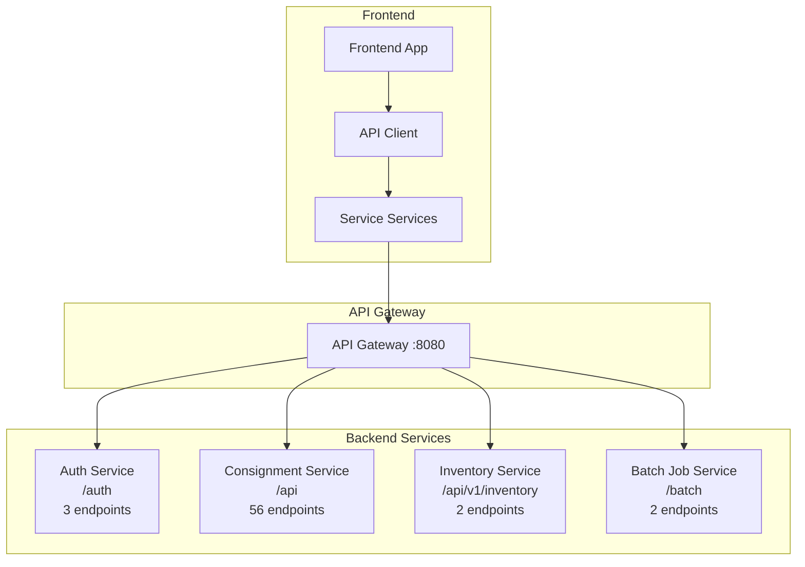

# API Service Implementation Plan

## Overview

This plan outlines the changes needed to align the frontend service configuration with the backend API architecture. The backend has 4 main services as documented in `api-endpoint.md`.

## Current State vs Target State

### Current Frontend Services (6 services):
```javascript
SERVICES: {
    AUTH: '',           // /auth
    TRACE_LOG: '',      // /api/trace-log
    MASTER_SETUP: '',   // /api/master-setup
    TRANSACTION: '',    // /api/transaction
    SETTLEMENT: '',     // /api/settlement
    REPORT: ''          // /api/report
}
```

### Target Frontend Services (4 services):
```javascript
SERVICES: {
    AUTH: '',           // /auth
    CONSIGNMENT: '',    // /api
    INVENTORY: '',      // /api/v1/inventory
    BATCH: ''           // /batch
}
```

## Backend API Services Summary

| Service | Base URL | Endpoints | Description |
|---------|----------|-----------|-------------|
| Auth Service | `/auth` | 3 | Login, Register, Validate Token |
| Consignment Service | `/api` | 56 | All consignment operations |
| Inventory Service | `/api/v1/inventory` | 2 | Inventory availability and reservation |
| Batch Job Service | `/batch` | 2 | Settlement and report batch jobs |

### Consignment Service Sub-paths

The Consignment Service contains the following sub-modules:

| Module | Base Path | Endpoints |
|--------|-----------|-----------|
| Consignment Controller | `/api/v1/consignments` | 4 |
| Consignment Setup | `/api/consignment-setup` | 6 |
| CSA - Stock Adjustment | `/api/csa` | 4 |
| CSO - Stock Out | `/api/cso` | 6 |
| CSR - Stock Return | `/api/csr` | 6 |
| CSRQ - Stock Requisition | `/api/csrq` | 5 |
| CSRV - Stock Receive | `/api/csrv` | 5 |
| CSDO - Delivery Order | `/api/csdo` | 5 |
| Settlement | `/api/settlement` | 8 |
| Reports | `/api/reports` | 12 |
| Master Sync | `/api/acmm/master-sync` | 1 |

---

## Implementation Tasks

### Task 1: Update api-config.js

**File**: `src/main/webapp/static/js/api-config.js`

Change the SERVICES object from:
```javascript
SERVICES: {
    AUTH: '',
    TRACE_LOG: '',
    MASTER_SETUP: '',
    TRANSACTION: '',
    SETTLEMENT: '',
    REPORT: ''
}
```

To:
```javascript
SERVICES: {
    AUTH: '',         // Auth Service: /auth
    CONSIGNMENT: '',  // Consignment Service: /api
    INVENTORY: '',    // Inventory Service: /api/v1/inventory
    BATCH: ''         // Batch Job Service: /batch
}
```

---

### Task 2: Update ApiConfigController.java

**File**: `src/main/java/com/alpro/consignment/frontend/controller/ApiConfigController.java`

Remove old service values and add new ones:

**Remove:**
- `serviceTraceLog`
- `serviceMasterSetup`
- `serviceTransaction`
- `serviceSettlement`
- `serviceReport`

**Add:**
```java
@Value("${app.services.consignment:/api}")
private String serviceConsignment;

@Value("${app.services.inventory:/api/v1/inventory}")
private String serviceInventory;

@Value("${app.services.batch:/batch}")
private String serviceBatch;
```

Update the `getConfig()` method to return:
```java
services.put("AUTH", serviceAuth);
services.put("CONSIGNMENT", serviceConsignment);
services.put("INVENTORY", serviceInventory);
services.put("BATCH", serviceBatch);
```

---

### Task 3: Update application.yml

**File**: `src/main/resources/application.yml`

Change from:
```yaml
app:
  services:
    auth: ${SERVICE_AUTH:/auth}
    trace-log: ${SERVICE_TRACE_LOG:/api/trace-log}
    master-setup: ${SERVICE_MASTER_SETUP:/api/master-setup}
    transaction: ${SERVICE_TRANSACTION:/api/transaction}
    settlement: ${SERVICE_SETTLEMENT:/api/settlement}
    report: ${SERVICE_REPORT:/api/report}
```

To:
```yaml
app:
  services:
    auth: ${SERVICE_AUTH:/auth}
    consignment: ${SERVICE_CONSIGNMENT:/api}
    inventory: ${SERVICE_INVENTORY:/api/v1/inventory}
    batch: ${SERVICE_BATCH:/batch}
```

---

### Task 4: Update .env

**File**: `.env`

Change from:
```env
SERVICE_AUTH=/auth
SERVICE_TRACE_LOG=/api/trace-log
SERVICE_MASTER_SETUP=/api/master-setup
SERVICE_TRANSACTION=/api/transaction
SERVICE_SETTLEMENT=/api/settlement
SERVICE_REPORT=/api/report
```

To:
```env
SERVICE_AUTH=/auth
SERVICE_CONSIGNMENT=/api
SERVICE_INVENTORY=/api/v1/inventory
SERVICE_BATCH=/batch
```

---

### Task 5: Update .env.example

**File**: `.env.example`

Update with the same changes as `.env` file.

---

### Task 6: Update api-client.js Mock Data

**File**: `src/main/webapp/static/js/api-client.js`

Update `generateMockItems()` function to handle new service names:

- Replace `MASTER_SETUP` → `CONSIGNMENT` (for consignment-setup endpoints)
- Replace `TRANSACTION` → `CONSIGNMENT` (for CSA, CSO, CSR, etc.)
- Replace `SETTLEMENT` → `CONSIGNMENT` (for settlement endpoints)
- Replace `REPORT` → `CONSIGNMENT` (for report endpoints)
- Add `INVENTORY` mock data
- Add `BATCH` mock data

---

### Task 7: Create API Service Modules

Create dedicated JavaScript modules for each service to organize API calls:

#### 7.1 Auth API Service
**File**: `src/main/webapp/static/js/services/auth-service.js`

```javascript
var AuthService = {
    login: function(credentials) {
        return ApiClient.post('AUTH', '/login', credentials);
    },
    register: function(userData) {
        return ApiClient.post('AUTH', '/register', userData);
    },
    validateToken: function() {
        return ApiClient.post('AUTH', '/validate');
    }
};
```

#### 7.2 Consignment API Service
**File**: `src/main/webapp/static/js/services/consignment-service.js`

Contains all consignment-related API calls organized by sub-module:
- Consignment Requests
- Consignment Setup
- CSA - Stock Adjustment
- CSO - Stock Out
- CSR - Stock Return
- CSRQ - Stock Requisition
- CSRV - Stock Receive
- CSDO - Delivery Order
- Settlement
- Reports
- Master Sync

#### 7.3 Inventory API Service
**File**: `src/main/webapp/static/js/services/inventory-service.js`

```javascript
var InventoryService = {
    getAvailability: function(sku) {
        return ApiClient.get('INVENTORY', '/' + sku + '/availability');
    },
    reserve: function(data) {
        return ApiClient.post('INVENTORY', '/reserve', data);
    }
};
```

#### 7.4 Batch Job API Service
**File**: `src/main/webapp/static/js/services/batch-service.js`

```javascript
var BatchService = {
    triggerSettlement: function(businessDate) {
        var params = businessDate ? '?businessDate=' + businessDate : '';
        return ApiClient.post('BATCH', '/settlement/trigger' + params);
    },
    triggerReport: function(reportDate) {
        var params = reportDate ? '?reportDate=' + reportDate : '';
        return ApiClient.post('BATCH', '/report/trigger' + params);
    }
};
```

---

## Architecture Diagram



---

## Service Mapping Reference

### Old to New Service Mapping

| Old Service | New Service | Path Prefix |
|-------------|-------------|-------------|
| AUTH | AUTH | `/auth` |
| TRACE_LOG | CONSIGNMENT | `/api/trace-log` → removed or under `/api` |
| MASTER_SETUP | CONSIGNMENT | `/api/master-setup` → `/api/consignment-setup` |
| TRANSACTION | CONSIGNMENT | `/api/transaction` → `/api/csa`, `/api/cso`, etc. |
| SETTLEMENT | CONSIGNMENT | `/api/settlement` |
| REPORT | CONSIGNMENT | `/api/reports` |
| - | INVENTORY | `/api/v1/inventory` |
| - | BATCH | `/batch` |

---

## Testing Checklist

- [ ] Verify API config loads correctly from `/api/config`
- [ ] Test Auth Service endpoints (login, register, validate)
- [ ] Test Consignment Service endpoints (all sub-modules)
- [ ] Test Inventory Service endpoints
- [ ] Test Batch Job Service endpoints
- [ ] Verify mock data works in dev mode
- [ ] Verify error handling and token refresh still works

---

## Files to Modify

| File | Changes |
|------|---------|
| `src/main/webapp/static/js/api-config.js` | Update SERVICES object |
| `src/main/java/.../ApiConfigController.java` | Update service configuration |
| `src/main/resources/application.yml` | Update service paths |
| `.env` | Update environment variables |
| `.env.example` | Update example configuration |
| `src/main/webapp/static/js/api-client.js` | Update mock data generator |

## Files to Create

| File | Purpose |
|------|---------|
| `src/main/webapp/static/js/services/auth-service.js` | Auth API methods |
| `src/main/webapp/static/js/services/consignment-service.js` | Consignment API methods |
| `src/main/webapp/static/js/services/inventory-service.js` | Inventory API methods |
| `src/main/webapp/static/js/services/batch-service.js` | Batch Job API methods |

---

## Notes

1. **Backward Compatibility**: Existing JSP pages using the old service names will need to be updated to use the new service modules.

2. **Dev Mode**: The mock data generator needs to be updated to reflect the new service structure.

3. **Migration**: A find-and-replace operation will be needed across all JSP and JS files to update service name references.
